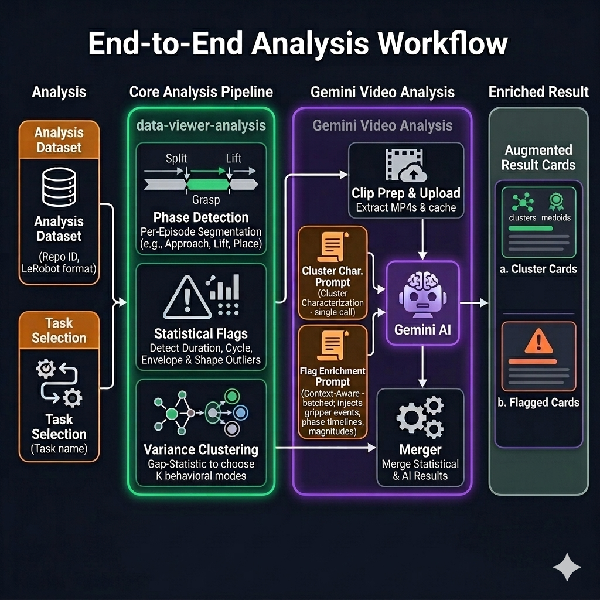

# Robot Episode Curator

Uses [LeRobot](https://github.com/huggingface/lerobot) to load datasets, [Rerun](https://rerun.io/) for native multi-modal playback, and [Gemini](https://aistudio.google.com/) for AI-driven episode quality analysis.

[](https://huggingface.co/spaces/jacob314159/robot-episode-curator)
[](LICENSE)

A web UI for browsing HuggingFace robotics datasets, watching episodes side-by-side, and surfacing data-quality issues that matter for training. Drop in any LeRobot-format repo and start exploring — the analysis pipeline flags duration outliers, action-envelope drift, and stylistic clusters per task.

Try the live demo on the [HuggingFace Space](https://huggingface.co/spaces/jacob314159/robot-episode-curator) above, or run it locally in five minutes.

## Quick Start (5 Minutes)

```bash
git clone https://github.com/kaiding-ucb/robot-episode-curator.git
cd robot-episode-curator
make install
cp .env.example .env    # paste HF_TOKEN; GEMINI_API_KEY only if you want AI analysis
make dev
```

Backend → http://localhost:8000   ·   Frontend → http://localhost:3000

Get tokens: [HuggingFace](https://huggingface.co/settings/tokens) (read scope is enough) · [Gemini](https://aistudio.google.com/apikey)

> Port already taken? `PORT=8765 FRONTEND_PORT=3765 make dev`

## End-to-End Analysis Workflow



The pipeline runs per-episode **phase segmentation**, statistical flag detection (duration, cycle, envelope, shape outliers), and **Bayesian variance clustering**. Representative clips from each cluster are sent to **Gemini** for characterization and flag enrichment. Output is a deck of cluster cards and flagged-episode cards rendered next to the data.


## Supported Datasets

Out-of-the-box adapters for:

| Format                     | Examples                                                                                                |
| -------------------------- | ------------------------------------------------------------------------------------------------------- |
| LeRobot v3 (parquet + mp4) | `lerobot/libero_*`, `lerobot/aloha_*`, `lerobot/droid_100`, `lerobot/umi_cup_in_the_wild` |

Add any HuggingFace Lerobot dataset via **+ Add Dataset** in the sidebar — the probe step auto-detects format.

## Architecture

```
backend/    FastAPI · Python 3.10+ · format-specific adapters & loaders
frontend/   Next.js 16 · React 19 · Tailwind · Rerun web viewer embedded
tests/      Real-data integration tests (require HF_TOKEN, no mocks)
```

The dual-adapter pattern (Loaders → Adapters → API Routes → Frontend) makes adding a new format ~200 lines: implement `BaseLoader` and `BaseAdapter`, register in `backend/adapters/registry.py`, done.
