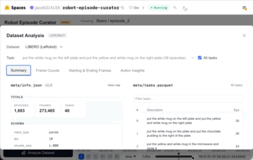

# Robot Episode Curator

Easily identify and curate outlier episodes in Lerobot datasets.

Uses [LeRobot](https://github.com/huggingface/lerobot) for dataset format, [Rerun](https://rerun.io/) for native multi-modal playback, and [Gemini](https://aistudio.google.com/) for video analysis enrichment.

[](https://rerun.io/)
[](https://huggingface.co/spaces/jacob314159/robot-episode-curator)
[](LICENSE)

<p align="center">
  
</p>

## Demo

Hosted demo on Hugging Face Spaces:

<a href='https://huggingface.co/spaces/jacob314159/robot-episode-curator'></a>

## Quick Start (5 Minutes)

```bash
git clone https://github.com/kaiding-ucb/robot-episode-curator.git
cd robot-episode-curator
make install
cp .env.example .env    # paste HF_TOKEN; GEMINI_API_KEY only if you want AI analysis
make dev
```

Open the printed frontend URL in your browser. Defaults are `http://localhost:3000` (frontend) and `http://localhost:8000` (backend) — pass `PORT=<backend>` and/or `FRONTEND_PORT=<frontend>` to use any free pair, e.g. `PORT=8765 FRONTEND_PORT=3765 make dev`. The frontend proxies `/api/*` to whatever `PORT` you choose, so no other config changes are needed.

Get tokens: [HuggingFace](https://huggingface.co/settings/tokens) (read scope is enough) · [Gemini](https://aistudio.google.com/apikey)

## End-to-End Analysis Workflow


The pipeline runs per-episode **phase segmentation**, statistical flag detection (duration, cycle, envelope, shape outliers), and **Bayesian variance clustering**. Representative clips from each cluster are sent to **Gemini** for characterization and flag enrichment. Output is a deck of cluster cards and flagged-episode cards rendered next to the data.


## Supported Datasets

Out-of-the-box adapters for:

| Format                     | Examples                                                                                                |
| -------------------------- | ------------------------------------------------------------------------------------------------------- |
| LeRobot v3 (parquet + mp4) | `lerobot/libero_*`, `lerobot/aloha_*`, `lerobot/droid_100`, `lerobot/umi_cup_in_the_wild` |

Add any HuggingFace Lerobot dataset via **+ Add Dataset** in the sidebar — the probe step auto-detects format.
